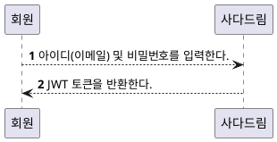
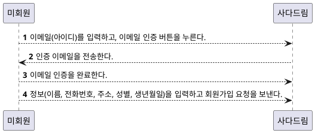
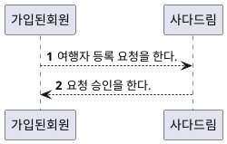
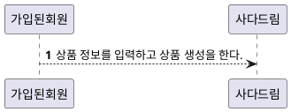

# API 목표 캔버스

### 양식

| 누가 | 무엇을 |  어떻게  |  입력(원천)  |  출력  |  목표  |
|:----|:------|:---|:---|:---|:---|
|  누가 사용자 인가요?   |  그들이 무엇을 할 수 있나요?    |  그들이 그걸 어떻게 하나요?  |  무엇이 필요한가요?, 그것은 어디서 오나요?  |  그들은 무엇을 반환받나요? 그것은 어떻게 쓰이나요?  |  재구성된 어떻게 + 입력 + 출력  |

정확한 API를 만들기 위해서는 다른 타입의 사용자들을 식별하고 또한 목적을 명확하게 하기 위해서 위의 양식에 맞게 정리한다.

### 로그인
---
| 누가 | 무엇을 |  어떻게  |  입력(원천)  |  출력  |  목표  |
|:----|:------|:---|:---|:---|:---|
|  가입된 회원   |  자신에 대한 인증 및 인가를 한다.    |  아이디와 비밀번호를 입력하고, 로그인 버튼을 누른다.  |  아이디, 비밀번호  |  JWT 토큰을 반환한다.  |  회원에 대한 인증 및 인가가 이루어진다.  |

### 회원 가입
---
| 누가                 | 무엇을         | 어떻게               | 입력(원천)                                     | 출력       | 목표                              |
|:--------------------|:---------------|:-------------------|:----------------------------------------------|:----------|:---------------------------------|
| 아직 가입되지 않은 회원 | 회원 가입을 한다 | 이메일 요청을 보낸다   | 이메일                                         | 인증 이메일 | 이메일 계정의 소유자임을 확인하기 위해서 |
|                     |                |    이메일 인증을 한다.                |                    이메일 인증 링크                           |           |                 자신이 해당 이메일에 대한 소유자임을 확인                 |
|                     |                | 회원 가입 요청을 한다. | 이메일(인증된), 이름, 전화번호, 주소, 성별, 생년월일 | JWT 토큰  | 회원가입을 하기 위해서                |

### 여행자 등록
---
| 누가       | 무엇을              | 어떻게                | 입력(원천) | 출력 | 목표             |
|:----------|:-------------------|:---------------------|:---------|:----|:-------------------------|
| 가입된 회원 | 여행을 등록하기 위해서 | 여행자 등록을 요청한다. | 여권 사진  |     | 여행자 등록을 요청하기 위하여 |
|      관리자     |      여행 등록 요청을 승인한다.              |              여행자의 신원을 확인한 후 등록 요청을 승인한다.        |          |     |            여행자 등록 요청을 승인하여, 회원에게 여행등록 권한을 부여한다.       |

### 상품 등록
---
| 누가 | 무엇을 |  어떻게  |  입력(원천)  |  출력  |  목표  |
|:----|:------|:---|:---|:---|:---|
|  회원  |  요청할 상품 게시물을 생성한다. |  상품 정보를 입력한다 | 상품 사진, 상품명, 요청 상세 설명, 여행자가 참고할 정보 (선택)   |  생성된 상품  |  요청 상품을 등록한다. |

